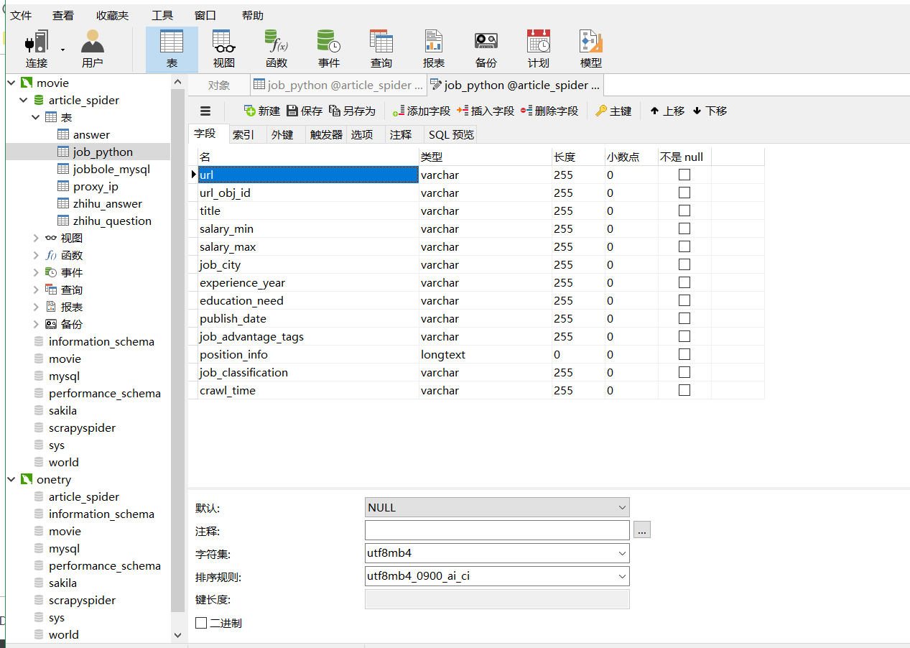
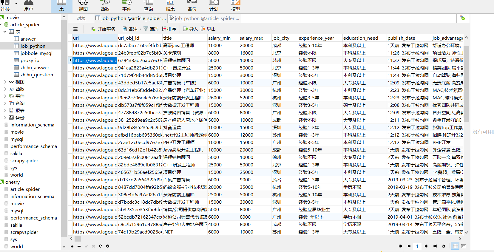

# 拉钩网数据爬取

## 1,软件安装需求
	 本人基于python语言，Scrapy框架对lagou网进行数据爬取。
	 外部软件：
		MySql： 存储数据表
        Navicat for MySql：对数据表，进行可视化操作。

     python库文件:
	    Scrapy
		pickle
		logging
		datetime
##2, Navicat for MySql的表结构设计图：
	    - Scrapy
	    - pickle
	    - logging
	    - datetime
     第三方软件：
        chromedriver.exe， 百度，谷歌，很容易下载到。本人将其放在了c盘根目录下。
	这是个自动调用第三方浏览器的工具。

## 2, Navicat for MySql的表结构设计图：

  

##3，程序运行流程。
###3.1 修改 Lagou/Lagou/spiders中，方法start_requests 中
## 3，程序运行流程。
### 3.1 修改 Lagou/Lagou/spiders中，方法start_requests 中
	username = ‘自己的账号’
	passwd   = ‘自己的密码’
###3.2 运行软件：
### 3.2 运行软件：
	进入 Lagou/下：
		python main.py

##4，从lagou网上跑去的数据内容。
## 4，从lagou网上跑去的数据内容。
   点击运行获取我们设计好的结构进行爬取。

   
   
## 5, 借鉴别人
   1, [FunpySpiderSearchEngine](https://github.com/mtianyan/FunpySpiderSearchEngine) :这个课程已经很多都不能跑通了，这是个学习不错的平台。
   2，借鉴了另一位大神的 sesssion书写，以及 chromedriver.exe调用代码，但因为 这是很久之前的代码，所以 他的 原始地址忘记了，说声抱歉。
